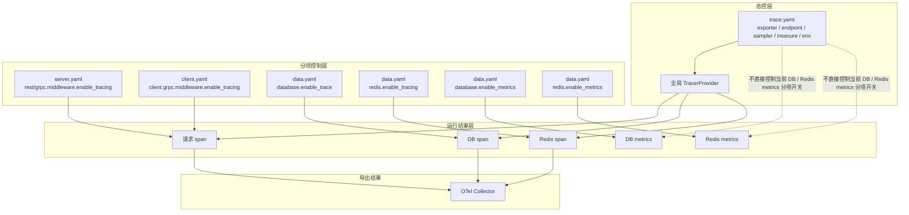
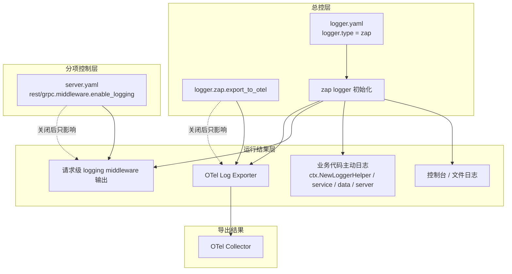

# Admin 观测性与中间件配置指南

## 1. 目标

本文档用于说明 `admin` 项目中与日志、链路追踪、数据库追踪、Redis 追踪、请求中间件相关的配置项分别控制什么，以及它们之间的边界。

重点回答一个常见误解：

- 把 `server.yaml` 里的 `middleware.enable_*` 改成 `false`，并不等于“整个系统停止向 OTel 输出 trace / log”。

## 2. 结论先行

`server.yaml` 和 `client.yaml` 里的 `middleware.enable_*`，当前控制的是“是否把对应 middleware 挂到 HTTP/gRPC 请求处理链上”。

它们不直接控制下面这些能力：

- 全局 `TracerProvider` 是否初始化
- 数据库 `otelsql` tracing 是否启用
- Redis `redisotel` tracing 是否启用
- zap 日志是否导出到 OTel

因此，出现下面这种现象是合理的：

1. 你把 `server.rest.middleware.enable_logging` / `enable_tracing` 都关掉
2. 命令行窗口里的请求日志明显变少甚至消失
3. 但 `otelcol` 里仍然能看到大量 trace / log

原因通常不是“开关失效”，而是你关掉的是“请求 middleware”，而 OTel 数据来自别的链路。

## 3. 配置项与控制范围总表

| 配置文件 | 配置项 | 当前控制范围 | 不控制什么 |
|---|---|---|---|
| `configs/server.yaml` | `server.rest.middleware.enable_logging` | REST 请求级 logging middleware | zap logger 初始化、文件日志、OTel 日志导出 |
| `configs/server.yaml` | `server.rest.middleware.enable_tracing` | REST 请求级 tracing middleware | 全局 tracer、DB tracing、Redis tracing |
| `configs/server.yaml` | `server.rest.middleware.enable_recovery` | REST 请求级 recovery middleware | Gin 自身底层 panic 保护、进程级异常行为 |
| `configs/server.yaml` | `server.rest.middleware.enable_validate` | REST 请求级 proto validate middleware | 业务层手写校验 |
| `configs/server.yaml` | `server.rest.middleware.enable_metadata` | REST 请求级 metadata middleware | 全局 trace context / logger fields |
| `configs/server.yaml` | `server.rest.middleware.enable_circuit_breaker` | REST 请求级 breaker middleware | DB/Redis 自身连接失败、客户端超时 |
| `configs/server.yaml` | `server.grpc.middleware.*` | gRPC 请求级 middleware | REST 链路、全局 tracer/logger |
| `configs/client.yaml` | `client.grpc.middleware.*` | gRPC 客户端调用链 middleware | 服务端请求链、全局 tracer/logger |
| `configs/trace.yaml` | `trace.*` | 全局 TracerProvider/exporter 初始化 | 是否挂载请求 middleware |
| `configs/data.yaml` | `data.database.enable_trace` | 数据库 `otelsql` tracing | 请求级 middleware tracing |
| `configs/data.yaml` | `data.database.enable_metrics` | 数据库 metrics | 请求级 middleware |
| `configs/data.yaml` | `data.redis.enable_tracing` | Redis `redisotel` tracing | HTTP/gRPC 请求 middleware |
| `configs/data.yaml` | `data.redis.enable_metrics` | Redis metrics | 请求级 middleware |
| `configs/logger.yaml` | `logger.zap.export_to_otel` | zap 日志是否额外导出到 OTel | 请求级 logging middleware 是否挂载 |

## 4. `server.yaml` / `client.yaml` 的 `enable_*` 到底控制什么

### 4.1 服务端 middleware

代码位置：

- [internal/server/transport_config.go](../internal/server/transport_config.go)

当前服务端中间件挂载逻辑为：

- `enable_recovery` -> `recovery.Recovery()`
- `enable_tracing` -> `tracing.Server()`
- `enable_validate` -> `validate.ProtoValidate()`
- `enable_metadata` -> `metadata.Server()`
- `limiter != nil` -> `ratelimit.Server(...)`
- `enable_circuit_breaker` -> `serverCircuitBreakerMiddleware(...)`
- `enable_logging` -> `logging.Server(appCtx.GetLogger())`

这意味着：

1. 它们控制的是请求进入服务时，是否经过这层 middleware。
2. 它们只影响对应的 transport 链路。
3. REST 和 gRPC 各有一套，彼此独立。

### 4.2 客户端 middleware

代码位置：

- [configs/client.yaml](../configs/client.yaml)

这套配置控制的是“本服务作为客户端去调用其他 gRPC 服务时”的 middleware 挂载，不控制当前 `admin` 对外提供 HTTP/REST 时的行为。

## 5. OTel 导出控制关系视图

这一节先不展开代码细节，先用两张图把“谁控制谁”说明白。

### 5.1 Trace / Metrics 控制关系图



简洁说明：

- `trace.yaml` 控制的是**全局 trace provider / exporter**，不是请求 middleware 的开关。
- `server.yaml` / `client.yaml` 的 `enable_tracing` 只控制“请求链上是否产生请求 span”。
- `data.yaml` 的 `database.enable_trace`、`redis.enable_tracing` 分别控制 DB / Redis 是否产生 span。
- 因此，请求 tracing 关掉以后，DB/Redis tracing 仍然可能继续往 `otelcol` 输出。
- 当前 `trace.yaml` 主要约束的是 trace 导出链；`database.enable_metrics` / `redis.enable_metrics` 是分项 metrics 开关，不受 `server.middleware.enable_tracing` 约束。

### 5.2 Logger 控制关系图



简洁说明：

- `enable_logging` 控制的是**请求级 logging middleware**，不是整个 logger 系统。
- `logger.zap.export_to_otel` 控制的是“zap 日志是否额外导出到 OTel”。
- 所以“命令行里的请求日志没有了”与“OTel 里还有业务错误日志”可以同时成立。

### 5.3 图后的核心结论

1. `server.yaml` / `client.yaml` 的 middleware 开关是**请求链分项控制**。
2. `trace.yaml` 是**全局 trace provider / exporter 配置**，但当前没有单独 `enabled` 总开关。
3. `logger.yaml` 中的 `logger.zap.export_to_otel` 是**OTel 日志导出总控**。
4. `data.yaml` 中的 `database.enable_trace`、`redis.enable_tracing` 是**DB / Redis tracing 分项控制**。
5. 因此，关闭请求 middleware，不等于关闭 OTel 导出。

### 5.4 全局 TracerProvider 仍然会初始化

代码位置：

- [internal/bootstrap/infra.go](../internal/bootstrap/infra.go)
- [../../xkitpkg/tracer/tracer.go](../../xkitpkg/tracer/tracer.go)

`admin` 启动时会执行：

- `NewTracer(appCtx)`
- `tracer.NewTracerProviderWithShutdown(...)`

这里读的是：

- [configs/trace.yaml](../configs/trace.yaml)

不是：

- `server.rest.middleware.enable_tracing`
- `server.grpc.middleware.enable_tracing`

所以：

- 即便你把请求 middleware 的 `enable_tracing` 关掉，只要 `trace.yaml` 还保留有效 exporter 配置，全局 tracer 仍然存在。

### 5.4.1 `trace.yaml` 中到底哪个参数控制 tracer 初始化

先说当前真实实现结论：

- `trace.yaml` 里**没有一个显式的 `enabled` / `enable_tracing` 总开关**。
- 当前是否会进入 `NewTracer(...)` 初始化链，取决于：
  - `serverConfig.GetTrace()` 是否存在
- 当前是否会真正创建 exporter 并向外导出 span，主要取决于：
  - `trace.exporter`
  - `trace.endpoint`

代码行为来自：

- [internal/bootstrap/infra.go](../internal/bootstrap/infra.go)
- [../../xkitpkg/tracer/tracer.go](../../xkitpkg/tracer/tracer.go)
- [../../xkitpkg/tracer/factory.go](../../xkitpkg/tracer/factory.go)

当前逻辑是：

1. 只要 `serverConfig.GetTrace() != nil`，就会调用 `NewTracerProviderWithShutdown(...)`
2. `NewTracerProviderWithShutdown(...)` 总是会创建一个全局 `TracerProvider`
3. 只有当 `trace.endpoint` 非空时，才会继续按 `trace.exporter` 创建 exporter，并挂 `WithBatcher(exp)`

这意味着：

- `trace.yaml` 存在 + `endpoint` 非空
  - 会初始化 tracer provider
  - 会初始化 exporter
  - 会真正向外导出 trace
- `trace.yaml` 存在 + `endpoint` 为空
  - 仍会初始化 tracer provider
  - 但不会创建 exporter
  - 通常不会再向 `otelcol` 导出 trace

因此，如果你问“**用于控制 trace 初始化到底是哪个参数**”，当前最准确的回答是：

- **没有单独显式开关**
- “初始化 provider”由 `trace` 配置块是否存在决定
- “是否真正导出到外部”主要由 `trace.endpoint` 是否非空决定，前提是 `trace.exporter` 能匹配到已注册 exporter

### 5.4.2 `trace.yaml` 各字段当前的真实作用

`trace.yaml` 当前示例：

```yaml
trace:
  exporter: "otlp-grpc"
  endpoint: "localhost:4317"
  sampler: 1.0
  env: "dev"
  insecure: true
  batcher_options:
    enabled: true
    max_queue_size: 2048
    max_export_batch_size: 512
    schedule_delay_millis: 5000
    export_timeout_millis: 30000
  enable_trace_context: true
  enable_baggage: false
```

这些字段在当前代码里的实际状态如下：

| 字段 | 当前是否生效 | 当前作用 |
|---|---|---|
| `exporter` | 是 | 决定使用哪种 exporter factory，例如 `otlp-grpc` / `otlp-http` / `stdout` |
| `endpoint` | 是 | 决定 exporter 连接的目标地址；为空时通常不会挂 exporter |
| `sampler` | 是 | 设置 `TraceIDRatioBased(sampler)` 采样率，`0` 会被当作 `1.0` |
| `env` | 是 | 写入 tracer resource 的 `service.env` |
| `insecure` | 是 | 传给 OTLP exporter，决定是否使用 insecure 方式连接 |
| `batcher_options.enabled` | 否 | 当前代码未读取 |
| `batcher_options.max_queue_size` | 否 | 当前代码未读取 |
| `batcher_options.max_export_batch_size` | 否 | 当前代码未读取 |
| `batcher_options.schedule_delay_millis` | 否 | 当前代码未读取 |
| `batcher_options.export_timeout_millis` | 否 | 当前代码未读取 |
| `enable_trace_context` | 否 | 当前代码未读取 |
| `enable_baggage` | 否 | 当前代码未读取 |

也就是说，当前 `trace.yaml` 里真正对初始化和导出行为起作用的，主要是：

- `exporter`
- `endpoint`
- `sampler`
- `env`
- `insecure`

而下面这些字段虽然已经进入 proto，但当前还更像“预留设计”，尚未真正接到运行逻辑：

- `batcher_options.*`
- `enable_trace_context`
- `enable_baggage`

### 5.5 数据库 tracing 走的是 `data.yaml`

代码位置：

- [internal/data/bootstrap/ent_client.gen.go](../internal/data/bootstrap/ent_client.gen.go)
- [../../x-crud/entgo/client.go](../../x-crud/entgo/client.go)

`admin` 当前数据库初始化是：

- `CreateDriver(driver, dsn, enableTrace, enableMetrics)`

配置来源：

- [configs/data.yaml](../configs/data.yaml) 中的 `data.database.enable_trace`

所以只要这里还是：

```yaml
data:
  database:
    enable_trace: true
```

那么即使请求级 `enable_tracing=false`，OTel 里仍然会看到数据库相关 span。

### 5.6 Redis tracing 走的是 `data.yaml`

代码位置：

- [../../xkitpkg/cache/redis.go](../../xkitpkg/cache/redis.go)
- [../../xkitpkg/cache/cluster_redis.go](../../xkitpkg/cache/cluster_redis.go)

Redis tracing 的开关是：

- `data.redis.enable_tracing`

不是：

- `server.rest.middleware.enable_tracing`

也就是说：

- 只要 Redis cache 初始化时启用了 `redisotel.InstrumentTracing(...)`，OTel 里就仍然会有 Redis spans。

## 6. 为什么关了 `enable_logging` 命令行日志少了，但 OTel 里可能还有日志

### 6.1 `enable_logging` 控制的是请求级 logging middleware

代码位置：

- [internal/server/transport_config.go](../internal/server/transport_config.go)

关掉它后，最直接的效果通常是：

- 请求入口/出口那类 access log 不再打印
- 你在运行窗口里看到的“每个请求一条”的日志明显减少

### 6.2 zap 导出到 OTel 走的是 `logger.yaml`

代码位置：

- [configs/logger.yaml](../configs/logger.yaml)
- [../../xkitpkg/logger/zap/client.go](../../xkitpkg/logger/zap/client.go)

真正控制“zap 日志是否导出到 OTel”的是：

```yaml
logger:
  zap:
    export_to_otel: false
```

如果这里是 `true`，那么：

- 即使你关掉了请求级 `enable_logging`
- 业务代码里主动调用的 `log.Infof/Errorf(...)`
- data/service/server 中手写的错误日志

仍然可能被送到 OTel。

## 7. 常见配置场景

### 7.1 只想关闭请求级 middleware，但保留 DB trace

适用场景：

- 你想减少请求级 span / access log 干扰
- 但还想保留数据库观测

可调整：

```yaml
server:
  rest:
    middleware:
      enable_logging: false
      enable_tracing: false
      enable_recovery: false
      enable_validate: false
      enable_circuit_breaker: false
      enable_metadata: false
```

结果：

- REST 请求级 middleware 基本关闭
- 但 `trace.yaml`、`data.database.enable_trace`、`data.redis.enable_tracing` 仍可能继续向 OTel 输出数据

### 7.2 想彻底关闭 HTTP/gRPC 请求 trace，但保留日志

至少应同时检查：

1. `server.rest.middleware.enable_tracing`
2. `server.grpc.middleware.enable_tracing`
3. `client.grpc.middleware.enable_tracing`

如果只改其中一项，另一条链路仍可能产生 trace。

### 7.3 想尽量停止向 OTel 输出 trace

至少应同时检查：

1. [configs/trace.yaml](../configs/trace.yaml)
   - 全局 tracer exporter 配置
   - 当前没有显式 `enabled` 开关
   - 若要尽量停止导出，至少要检查 `endpoint` / `exporter`
2. [configs/data.yaml](../configs/data.yaml)
   - `data.database.enable_trace`
   - `data.redis.enable_tracing`
3. [configs/server.yaml](../configs/server.yaml)
   - `rest.middleware.enable_tracing`
   - `grpc.middleware.enable_tracing`
4. [configs/client.yaml](../configs/client.yaml)
   - `client.grpc.middleware.enable_tracing`

如果只是把 `server.yaml` 的 `enable_tracing` 关掉，通常不够。

补充：

- 如果你只是想让 `otelcol` 不再收到 trace，而暂时不改代码，当前最直接的配置层做法是：
  - 让 `trace.endpoint` 为空
  - 同时关闭 `data.database.enable_trace`
  - 同时关闭 `data.redis.enable_tracing`

### 7.4 想停止向 OTel 输出日志，但保留本地文件/控制台日志

检查：

- [configs/logger.yaml](../configs/logger.yaml)

建议：

```yaml
logger:
  zap:
    log_to_console: true
    export_to_otel: false
```

这样通常意味着：

- 本地控制台/文件日志仍保留
- OTel 日志导出关闭

## 8. 当前仓库下最容易混淆的几点

### 8.1 `enable_tracing` 有多层，不是一个总开关

当前仓库里至少有三类 tracing 开关：

1. 请求 middleware tracing
2. 数据库 / Redis tracing
3. 全局 tracer exporter 初始化

它们互相有关联，但不是同一个开关。

### 8.2 `enable_logging` 不是“日志系统总开关”

它当前只影响请求级 logging middleware。

不影响：

- `ctx.NewLoggerHelper(...)` 创建出来的 logger
- service/data/server 代码里主动打印的日志
- zap 是否写本地文件
- zap 是否导出到 OTel

### 8.3 REST 和 gRPC 是两套 middleware 配置

很多“改了配置没效果”的原因，是只改了：

- `server.rest.middleware.*`

但实际流量还走了：

- `server.grpc.middleware.*`

或者反过来。

## 9. 排查建议

当你发现“配置改了，但 OTel 里仍然有数据”时，建议按这个顺序排查：

1. 先确认你改的是 `rest` 还是 `grpc`，还是两者都改了
2. 再确认是不是全局 tracer 还开着
   - 当前没有单独 `enabled` 开关，要看 `trace` 配置块和 `endpoint`
3. 再确认 `data.database.enable_trace` 是否还是 `true`
4. 再确认 `data.redis.enable_tracing` 是否还是 `true`
5. 再确认 `logger.zap.export_to_otel` 是否还是 `true`
6. 最后再看 OTel 里留下的数据到底是：
   - 请求 span
   - DB span
   - Redis span
   - OTel log record

不同类型的数据，来源链路不同，不能只盯着 `server.middleware.enable_*` 看。

## 10. 建议的后续优化

从当前可维护性看，后续可以考虑做这几类改进：

1. 增加一份“观测性总开关”配置，明确控制：
   - 是否初始化 tracer exporter
   - 是否启用 DB tracing
   - 是否启用 Redis tracing
   - 是否启用 OTel log exporter
2. 给 `trace.yaml` 增加一个显式的 `enabled` 开关，避免当前“靠 `trace` 配置块存在与否、或靠 `endpoint` 是否为空间接控制”的隐式行为
3. 调整命名，减少 `enable_tracing` / `enable_trace` / `export_to_otel` 的语义混淆
4. 在文档或启动日志里明确打印：
   - 请求 tracing 是否挂载
   - DB tracing 是否启用
   - Redis tracing 是否启用
   - OTel log exporter 是否启用
   - tracer exporter 是否真正启用
   - 哪些 `trace.yaml` 字段当前只是预留、尚未生效

这样排障时就不需要靠猜。
